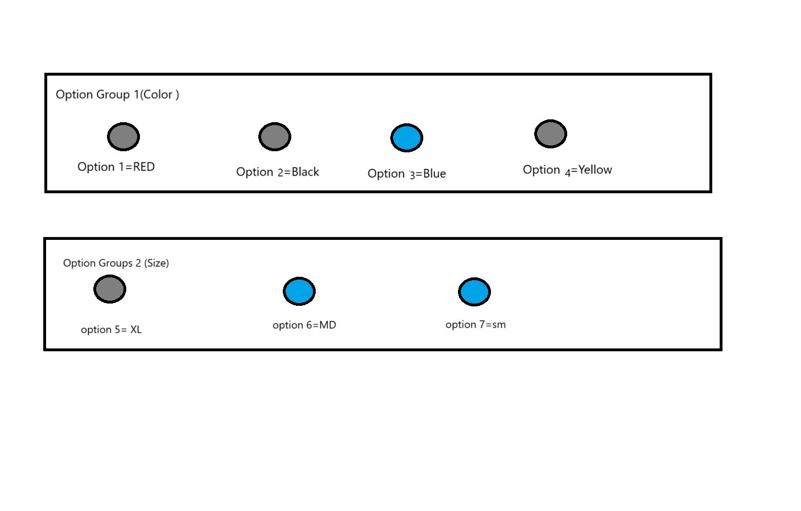

 "يرجى تنفيذ الشكل المطلوب باستخدام  test الرابط التالي من الـ API، مع التأكد من قراءة المتطلبات قبل بدء المهمة."
Api EndPpint= https://dashboard.eloroshop.com/eloroshopAppApi/v1/api/OptionGroups/Multi?productId=61

 


### **Your Goal**  


Create  form as shown in the image so you are required to activate only the radio button associated with the selected options. For example:

If the user selects the color blue (option 3), then only the available sizes 'Medium' and 'Small' should be activated, while 'Large' should be disabled.


---

### **English Explanation**  
The JSON structure consists of two main sections:  

1. **`optionGroupsLis` (List of Option Groups)**  
   - This is a list of available option groups, where each group represents a category of options (e.g., colors, sizes).  
   - Each **option group** contains:  
     - `optionGroupId`: A unique identifier for the option group.  
     - `isColor`: A boolean indicating whether the group represents colors.  
     - `optionGroupName`: The name of the option group in Arabic.  
     - `optionGroupNameEn`: The name of the option group in English.  
     - `options`: A list of available options within this group, where each option has:  
       - `optionId`: A unique identifier for the option.  
       - `name`: The option name in Arabic.  
       - `nameEn`: The option name in English.  
       - `colorHash`: A color code (if applicable).  

2. **`availableOptionLis` (List of Available Options)**  
   - This section defines the possible **combinations** of options that are available for selection.  
   - The **`possibilities`** list contains:  
     - `possibilityGroups`: A list of option groups and their corresponding selected options.  
     - `quantity`: The available stock for this combination.  
     - `increasingPrice`: The additional price for choosing this combination.  

#### **Example Interpretation:**  
#### **Example Interpretation:**  
- The first possibility includes:  
  - **Size:** "كبير" (XL)  
  - **Color:** "احمر" (Red)  
  - **Quantity Available:** 5  
  - **Extra Price:** 10.7  

- The second possibility includes:  
  - **Size:** "كبير" (XL)  
  - **Color:** "ازرق" (Blue)  
  - **Quantity Available:** 5  
  - **Extra Price:** 11.55  

---
#### **  Important note:**  

  Enable only the available options from `availableOptionList`, and disable all others.

## JSON Example

 
```json
{
  "availableOptionList": {
    "possibilities": [
      {
        "possibilityGroups": [
          {
            "optionGroupId": 1,
            "optionId": 3
          },
          {
            "optionGroupId": 2,
            "optionId": 2
          }
        ],
         "possibilityGroups": [
          {
            "optionGroupId": 1,
            "optionId": 3
          },
          {
            "optionGroupId": 2,
            "optionId": 3
          }
        ]
      }
    ]
  }
}
```

#### **deadline:**  

You have to submit this project with the code and app here on GitHub. The deadline will be the end of Saturday, 15-02-2025. If you want to contact us, we will be available tomorrow at 11:00.


Api EndPpint= https://dashboard.eloroshop.com/eloroshopAppApi/v1/api/OptionGroups/Multi?productId=61

 قم بإنشاء النموذج كما هو موضح في الصورة .
يجب عليك تفعيل زر الراديو المرتبط بالخيار الذي يتم اختياره فقط. على سبيل المثال:

إذا اختار المستخدم اللون الأزرق (الخيار 3)، فيجب تفعيل الأحجام المتاحة 'متوسط' و'صغير' فقط، بينما يجب تعطيل 'كبير


### **  شرح  json  بالعربية**  
يتكون هيكل JSON من قسمين رئيسيين:  

1. **`optionGroupsLis` (قائمة مجموعات الخيارات)**  
   - هذه قائمة بمجموعات الخيارات المتاحة، حيث تمثل كل مجموعة فئة من الخيارات (مثل الألوان أو الأحجام).  
   - تحتوي كل **مجموعة خيارات** على:  
     - `optionGroupId`: رقم المجموعة الرئيسية.  
     - `isColor`: قيمة منطقية تحدد ما إذا كانت المجموعة تمثل الألوان أم لا.  
     - `optionGroupName`: اسم مجموعة الخيارات باللغة العربية.  
     - `optionGroupNameEn`: اسم مجموعة الخيارات باللغة الإنجليزية.  
     - `options`: قائمة بالخيارات المتاحة داخل هذه المجموعة، حيث يحتوي كل خيار على:  
       - `optionId`: رقم الخيار.  
       - `name`: اسم الخيار باللغة العربية.  
       - `nameEn`: اسم الخيار باللغة الإنجليزية.  
       - `colorHash`: رمز اللون (إذا كان ينطبق).  

2. **`availableOptionLis` (قائمة الخيارات المتاحة)**  
   - يحدد هذا القسم **الاحتمالات** الممكنة من الخيارات المتاحة للاختيار.  
   - تحتوي قائمة **`possibilities`** على:  
     - `possibilityGroups`: قائمة بمجموعات الخيارات مع الخيارات المحددة لها.  
     - `quantity`: عدد القطع المتاحة لهذه التوليفة.  
     - `increasingPrice`: السعر الإضافي لهذه التوليفة.  

#### **مثال على التفسير:**  
- الاحتمال الأول يتضمن:  
  - **الحجم:** "كبير" (XL)  
  - **اللون:** "احمر" (أحمر)  
  - **الكمية المتاحة:** 5  
  - **السعر الإضافي:** 10.7  

- الاحتمال الثاني يتضمن:  
  - **الحجم:** "كبير" (XL)  
  - **اللون:** "ازرق" (أزرق)  
  - **الكمية المتاحة:** 5  
  - **السعر الإضافي:** 11.55  

---


 #### **   ملاحظة مهمة: جدا**  

قم بتمكين الخيارات المتاحة فقط من `availableOptionList`، وتعطيل جميع الخيارات الأخرى.


 
 
## JSON مثال على 

 
```json
{
  "availableOptionList": {
    "possibilities": [
      {
        "possibilityGroups": [
          {
            "optionGroupId": 1,
            "optionId": 3
          },
          {
            "optionGroupId": 2,
            "optionId": 2
          }
        ],
         "possibilityGroups": [
          {
            "optionGroupId": 1,
            "optionId": 3
          },
          {
            "optionGroupId": 2,
            "optionId": 3
          }
        ]
      }
    ]
  }
}
```


#### **موعد التسليم:**  

يجب عليك تقديم هذا المشروع مع الكود والتطبيق هنا على GitHub. الموعد النهائي سيكون نهاية يوم السبت 15-02-2025. إذا كنت تريد التواصل معنا، سنكون متاحين غدًا الساعة 11:00.


